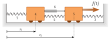

## Modelo de estados (en el dominio del tiempo)
Implica hallar un sistema de ecuaciones diferenciales de primer orden.


Ecuaciones de Newton:
$$ f - k_2 x_2 - k_{12} (x_2 - x_1) - b_{12} (\dot{x}_2 - \dot{x}_1) = m_2 \ddot{x}_2 $$
$$ k_{12} (x_2 - x_1) + b_{12} (\dot{x}_2 - \dot{x}_1) - k_1 x_1 = m_1 \ddot{x}_1 $$


Para hallar modelo de estados, cambio de variables

$$ z_1 = x_1 \Rightarrow \dot{z}_1 = \dot{x}_1 \Rightarrow \dot{z}_1 = \dot{x}_1 = z_2 $$
$$ z_2 = \dot{x}_1 \Rightarrow \dot{z}_2 = \ddot{x}_1 \Rightarrow \dot{z}_2 = \text{ ... despejar de ecuaciones de más arriba ...} $$
$$ z_3 = x_2 \Rightarrow \dot{z}_3 = \dot{x}_2 \Rightarrow \dot{z}_3 = z_4 $$
$$ z_4 = \dot{x}_2 \Rightarrow \dot{z}_4 = \ddot{x}_2 \Rightarrow \dot{z}_4 = \text{ ... despejar de ecuaciones de más arriba ...} $$


Despejando y reemplazando

$$ \dot{z}_1 = 0\,z_1 + 1\,z_2 + 0\,z_3 + 0\,z_4 + 0\,u $$
$$ \dot{z}_2 = -\frac{k_{12}+k_1}{m_1} z_1 - \frac{b_{12}}{m_1} z_2 + \frac{k_{12}}{m_1} z_3 + \frac{b_{12}}{m_1} z_4 + 0\,u $$
$$ \dot{z}_3 = 0\,z_1 + 0\,z_2 + 0\,z_3 + 1\,z_4 + 0\,u $$
$$ \dot{z}_4 = \frac{k_{12}}{m_2} z_1 + \frac{b_{12}}{m_2} z_2 - \frac{k_2 + k_{12}}{m_2} z_3 - \frac{b_{12}}{m_2} z_4 + \frac{1}{m_2} u $$


$$ A =
\begin{bmatrix}
0 & 1 & 0 & 0 \\[6pt]
-\dfrac{k_{12}+k_1}{m_1} & -\dfrac{b_{12}}{m_1} & \dfrac{k_{12}}{m_1} & \dfrac{b_{12}}{m_1} \\[10pt]
0 & 0 & 0 & 1 \\[6pt]
\dfrac{k_{12}}{m_2} & \dfrac{b_{12}}{m_2} & -\dfrac{k_2+k_{12}}{m_2} & -\dfrac{b_{12}}{m_2}
\end{bmatrix}
$$

$$ B = 
\begin{bmatrix}
0 \\[6pt]
0 \\[6pt]
0 \\[6pt]
\dfrac{1}{m_2}
\end{bmatrix}
$$



```{python}
#| echo: false
filename = "mys_clase_03a_mbk_2gdl.m"
```



## Función transferencia (en el dominio de la frecuencia)
Dado un sistema
$$ \dot{y}(t) + a y(t) = bu(t) $$

Se definen la siguientes transformadas

| Función original           | Función transformada                   |
|:--------------------------:|:--------------------------------------:|
| $y(t)$                     | $Y(s)$                                 |
| $\dot{y}(t)$               | $sY(s) - y(0)$                         |
| $\ddot{y}(t)$              | $s^2 Y(s) - s \space y(0) - \dot y(0)$ |
| $u(t)$                     | $U(s)$                                 |
: Transformadas de Laplace


Reemplazando:
$$ sY(s) - y(0) + a Y(s) = bU(s) $$

Despejando, obtenemos la función transformada.
$$ Y(s) = \frac{b}{s + a} U(s) + \frac{y(0)}{s + a} $$

La función transferencia de un sistema se determina considerando condiciones iniciales nulas, y se define como **el cociente entre la señal de salida y la señal de entrada**
$$ \frac{Y(s)}{U(s)} = \frac{b}{s + a}$$


### Comportamiento de un sistema de primer orden
Sea un sistema definido por la ecuación
$$ \dot{y} + 3 y(t) = u(t) $$

Su transformada de LaPlace es
$$ Y(s) - s y(0) + 3Y(s)= U(s) $$

Suponiendo CI nulas:
$$ Y(s) = \frac{1}{s+3} U(s) $$

Si la entrada fuera un impulso unitario: $U(s)=1$. Luego:
$$ Y(s) = \frac{1}{s+3} \longrightarrow y(t) = e^{-3t} $$

¿Cómo puede explicarse este comportamiento?




**Solución**

1. Gráfica de primer orden.
2. Función transferencia
$$ A(sY(s) - y(0)) = Q_i(s) - kY(s) $$
$$ A(sY(s) - y(0)) + kY(s) = Q_i(s) $$
$$ AsY(s) - Ay(0) + kY(s) = Q_i(s) $$
$$ (As + k) Y(s) - Ay(0) = Q_i(s) $$

Valor de $Y(s)$:
$$ Y(s) = \frac{1}{As + k} Q_i(s) + \frac{Ay(0)}{As + k} $$

Función transferencia:
$$ \frac{Y(s)}{Q_i(s)} = \frac{1}{As + k} = \frac{1/A}{s + k/A} = \frac{1/k}{\dfrac{A}{k} s + 1} $$

3. La variable compleja $s$ tienen unidades $rad/s$. Por tanto $A/k$: tiene unidad $s$ (segundos).

4. Las matrices fundamentales del modelo de estados ($A$ y $B$) pueden hallarse reescribiendo el sistema:
$$ \dot{y}(t) = \dfrac{-k}{A} y(t) + \dfrac{1}{A} q_i(t) $$

Para hallar las matrices de salida, es necesario escribir las ecuaciones de salida, como se desean obtener, en función del vector de estados (que en este caso es de 1 x 1) y la señal de entrada (que también es de 1x1)

$$ v_1(t) = 1 \space y(t) + 0 q_i(t) $$
$$ v_2(t) = -k/A \space y(t) + 1/A q_i(t) $$

Considerando que $v_1 = y$ y $v_2=\dot{y}$, podemos escribir las ecuaciones anteriores de manera matricial, obteniendo las matrices del enunciado.


## Sistema masa-resorte-amortiguador


Viene definido por
$$ f(t) - kx(t) - b\dot{x}(t) = m\ddot{x}(t) $$

Reescribiendo:
$$ \ddot{x}(t) = -\frac{k}{m} x -\frac{b}{m} \dot{x} + \frac{1}{m} f $$



**Solución**

1. Unidades de masa, conocidas: $[m] = kg$. Unidades de aceleración: $[\ddot{x}]=m/s^2$. Unidades de rapidez: $[\dot{x}] = m/s$. Unidades de fuerza: $[f] = N$. Las demás pueden derivarse a partir de la ecuación diferencial
$$ \frac{m}{s^2} = \frac{[k]}{kg} m \Longrightarrow [k] = \frac{N}{m} = \frac{kg}{s^2} $$

$$ \frac{m}{s^2} = \frac{[b]}{kg} m/s \Longrightarrow [b] = \frac{N}{m/s} = \frac{kg}{s} $$


2. En este caso el vector de estados es de 2 x 1. Puede ser útil realizar un cambio de variables, mirando la parte derecha de la ecuación original:
$$ x = x_1 $$
$$ x_2 = \dot{x} $$

Derivando cada una:
$$ x_1 = x \Rightarrow \dot{x}_1 = \dot{x} \Rightarrow \dot{x}_1 = x_2$$
$$ \dot{x} = x_2 \Rightarrow \dot{x}_2 = \ddot{x} \Rightarrow \dot{x}_2 = -\frac{k}{m} x -\frac{b}{m} \dot{x} + \frac{1}{m} f = -\frac{k}{m} x_1 -\frac{b}{m} x_2 + \frac{1}{m} f $$

En definitiva entonces:
$$ \dot{x}_1 = 0 \space x_1 + 1 \space x_2 + 0 \space f $$
$$ \dot{x}_2 = -\frac{k}{m} x_1 -\frac{b}{m} x_2 + \frac{1}{m} f $$

Escribiendo estas últimas dos ecuaciones de manera matricial, se arriba a las matrices del enunciado.

3. Respuesta usando ODE45
```{python}
#| echo: false
filename = "mys_clase_03b_mbk_ode45.m"
```



4. y 5. Función transferencia, respuesta temporal y ubicación de ceros y polos.
```{python}
#| echo: false
filename = "mys_clase_03c_me2ft.m"
```

