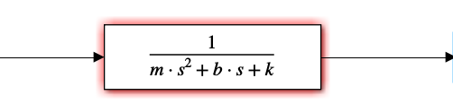
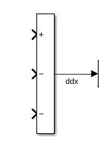
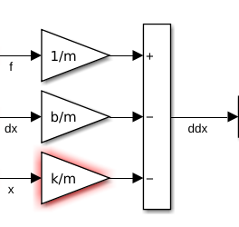
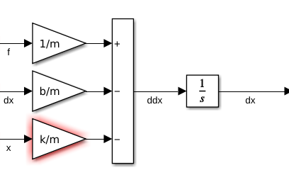
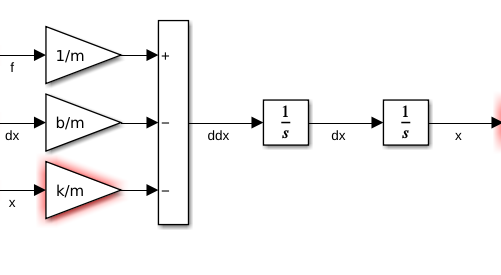
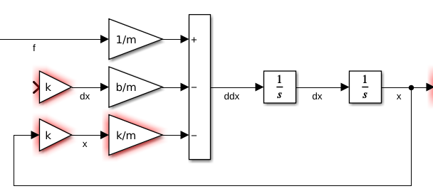
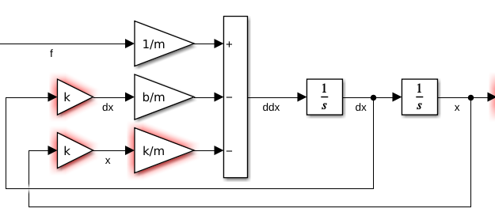

## Diagramas en bloques
Son una herramienta para representar ecuaciones, o sistemas de ecuaciones, gráficamente.



**Solución**

```{python}
#| echo: false
filename = "mys_clase_03a_antena_motor_lazo_abierto.m"
```





**Solución**
a. Reemplazando todos los términos en la primera ecuación, y transformando con condiciones iniciales nulas:
$$ F(s) - bs X(s) - k X(s) = ms^2 X(s) $$

Despejando el cociente de señal de salida sobre señal de entrada:
$$ \frac{X(s)}{F(s)} = \frac{1}{ms^2 + bs + k} $$


b. Reemplazo las expresiones de fuerza dependiente de $x$, y despejo derivada de mayor orden:
$$ f - b \dot{x} - k x = m \ddot{x} $$
$$ \ddot{x} = -\frac{k}{m} x - \frac{b}{m} \dot{x} + \frac{1}{m} f $$

Luego, en pasos

  
  
  
  
  
  




**Solución**
Usando diagrama en bloques:

```{python}
#| echo: false
filename = "mys_clase_03b_control_antena.m"
```


